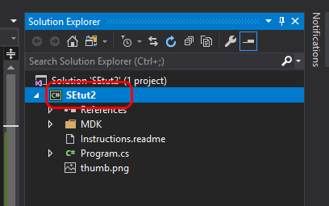
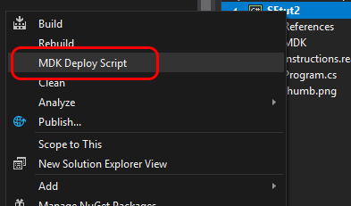
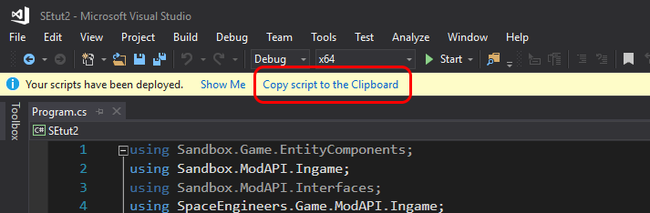
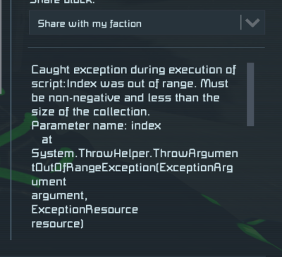

# 02. First script

Now it's time to write your first script.

We are going to create a runway with guiding lights. Look it up on the internet if you don't know what 
runway is.

First, let's establish some acronyms to make it easier to write and refer to blocks. Let's
call Interior Light simply `IL` and Programmable Block simply `PB`.

Now, for this task I prepared an area on the server and here is its GPS coordinates, named "Runway is here!":

`GPS:Runway is here!:-86025.74:-14470.52:86086:`

Copy the coordinate from here to the buffer, then go to the GPS panel in SE and click the "New from clipboard" 
button. Then add make it "Show on the HUD" and "Always visible", you know the drill.

There you will see two stripes of `IL`s (Interior Lights) that you will need to light up properly as 
runway lights.
The basic idea is the following:
1. PB runs for the first time and initializes its state, which is a list of lights and an index pointing to
elements in that list
2. The first time the `Main` method is executed, the first pair of lights is toggled.
3. Then the index is incremented to point to the second pair of lights.
4. Then steps 2 and 3 are repeated for every following pair of lights until the end of list is reached.

So, let's create another SE project in Visual Studio 2019. The process is the same as for the first one,
except name this one `SEtut2`.

After you've created the new project, copy the code below and replace corresponding code in the `Program.cs` 
file of the `SEtut2` project.

```csharp
namespace IngameScript
{
    /**
     * Curly brackets come in pairs - one opening curly bracket and corresponding closing
     * curly bracket.
     * "Corresponding" here means that each closing curly bracket closes the latest
     * opening curly bracket.
     * Each pair of curly brackets defines a scope.
     * Scope is a segment of code that defines where local variables are visible (or 
     * accessible). If a local variable is declared between a pair of curly brackets, it is
     * not accessible outside that pair of curly brackets.
     * 
     * Segments of code can be nested, i.e. one segment can be nested in another.
     * For instance, in the code below the segment of code defined by the constructor,
     * which starts with "public Program()", is nested into the segment defined by the
     * class, which starts with "partial class Program : MyGridProgram".
     **/
    partial class Program : MyGridProgram
    {
        // This is a constant. It cannot be changed programmatically.
        // Constants are useful when there is a value that may be used in multiple places.
        // In such a case it is easy to change it in one place in code rather than searching
        // all uses throughout the code.
        private const string RUNWAY_LIGHTS = "Runway Lights";

        // The line below is called a "statement". There are different kinds of statements.
        // The constant declaration above is the same kind of statement as the declaration
        // of "index" variable below.
        //
        // That statement below has two parts - the part to the left and the part to the
        // right part from the equals sign.
        //
        // The left side of the statement declares a variable named "index" to be
        // of type "int" (for "integer") and to be "private".
        // The right side of the statement defines the value that is assigned to the
        // variable with the equals sign.
        //
        // The name "index" suggests that it will point to something.
        //
        // The "private" keyword makes this variable visible only in scope of the
        // "Program" class.
        private int index = 0;

        // This is a list. It will contain all runway lights for you to manipulate.
        //
        // The left side of the statement declares the list and the type of variables
        // that will be stored in that list (IMyInteriorLight).
        // The right side of the statement creates a new instance of the "List" (also
        // called "object).
        //
        // The equals sign assigns that new object to the variable "interiorLights".
        // Without the right side of the statement the "interiorLights" variable wouldn't
        // have anything assigned to it and, hence, couldn't be used anywhere in the code.
        private List<IMyInteriorLight> interiorLights = new List<IMyInteriorLight>();

        public Program()
        {
            // Let's start slow, with updates every 100 ticks. You can change it later to 10
            // to make it look more like runway
            Runtime.UpdateFrequency = UpdateFrequency.Update100;

            // Let's obtain reference to the "Runway Lights" group.
            var blockGroup = GridTerminalSystem.GetBlockGroupWithName(RUNWAY_LIGHTS);

            // Use that group to get all the lights in the group into our list of lights.
            blockGroup.GetBlocksOfType(interiorLights);

            // This is a little advanced for you yet. We just need it to bring some order
            // to how the lights are stored in the list so that physical location of the 
            // lights corresponds to their location in the list.
            // E.g., light with name "Interior Light 01" will be the first light in the list,
            // after that the light with name "Interior Light 02" will follow.
            interiorLights.Sort((x, y) => x.DisplayNameText.CompareTo(y.DisplayNameText));

            // This is one of the loop constructs available in C#. There are others.
            // In this case we iterate over the runway lights list, by getting each of the
            // lights one by one, and disable each of them.
            foreach (IMyInteriorLight light in interiorLights)
            // These braces (or curly brackets) define the body of the loop.
            // Variable "light" is only available in the body of the loop and not outside of it.
            {
                light.Enabled = false;
            // End of loop's body.
            }
        }

        public void Main(string argument, UpdateType updateSource)
        {
            // At the very start the index is set to 0, which gives us first two lights.
            // Those are the ones at the beginning of the runway. Runway begins where the 
            // PB is located.
            var light1 = interiorLights[index];
            var light2 = interiorLights[index + 1];
            
            // Toggle both lights - if they were turned off, they will be turned on, and 
            // vice versa.
            light1.Enabled = !light1.Enabled;
            light2.Enabled = !light2.Enabled;

            // This can be used to debug the script. It outputs index value every time the Main 
            // method is executed into the Control Panel when PB is selected.
            Echo(index.ToString());
            
            // This tells us which lights are updated.
            Echo("Updated " + light1.DisplayNameText + " and " + light2.DisplayNameText);
            
            // Finally, we increment index to point to the next two lights in the list next
            // time Main method is executed. And so it goes until index reaches the end of the
            // list.
            index = index + 2;

            //
            /// ////////// ATTENTION ////////////
            // This script has a bug that you need to fix to ensure runway lights go on turning
            // on and off forever.
            // A tip: the size of the list can be obtained using "interiorLights.Count". You
            // will need to use it to make sure index doesn't go beyond the size of the list.
        }
    }
}
```

Now we need to produce actual script that `PB` will understand. You can find `Solution Explorer` on the right
in Visual Studio. There, right click on the `SEtut2`.



A popup menu will appear. Select `MDK Deploy Script`.



Unless there errors in code, `MDK Deploy Script` will generate the script and show additional buttons that you
can use to obtain the script. Click the `Copy script to the Clipboard` button.



Now you can go to the Control Panel in SE, select the `PB`, click the `Edit` button and paste the script.

Once you close the script window, script will be automatically executed and you will see the runway light up.

Set time to night so you can see the lights better, and looks much cooler that way too.

Now, the script above has a bug (or, more precisely, isn't finished). Read through all the comments I left for 
you to understand what is going on and how and then fix the bug where is says `////////// ATTENTION ////////////`.

The runway must have the lights going on and off in "waves" forever. However, the bug prevents the waves from
repeating. After all the lights turn on in the first wave, the `PB` will show an ugly error in the Control Panel.



Have a look at this [simple introduction into conditionals](https://docs.microsoft.com/en-us/dotnet/csharp/tutorials/intro-to-csharp/branches-and-loops?tutorial-step=1). 
And a little [more expanded version](https://docs.microsoft.com/en-us/dotnet/csharp/tutorials/intro-to-csharp/branches-and-loops?tutorial-step=2)
which shows how to use conditionals with bodies.

Good luck with fixing!

Let me know if you run into any problems or have any questions.
