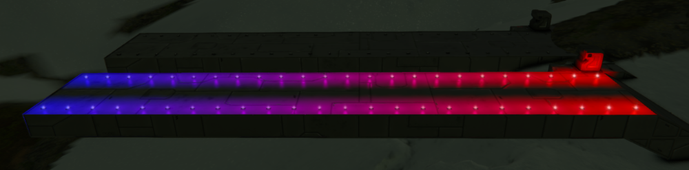
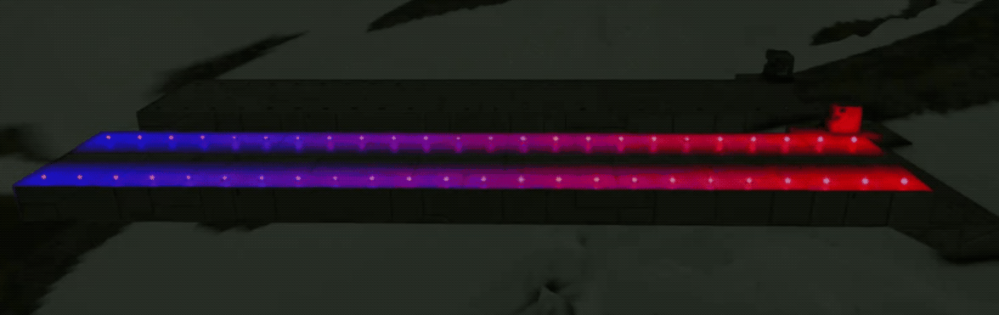

# 05. Advanced colorful runway, take 1

Based on our previous [Basic colorful runway created in part 4](04-basic-colorful-runway) we are going to make the colors change in waves instead of all together.

Create a new project and name it `SEtut5`. Copy the code from project `SEtut4` and paste it into `SEtut5` project.

In order to achieve the goal we will need to do two things:
1. Set up initial light colors to create a "wave"
2. Update color of each individual light similar to the [Basic colorful runway created in part 4](04-basic-colorful-runway).

Those two features will make the waves go smooth (meaning without sudden color changes) and eternally (well, as far as the battery isn't drained in creative mode, and the lights' warranty doesn't expire 😃).

So, let's jump right to it!

# <a name="initial-wave"></a> Initial "wave"

I hope you still remember which part of the program is executed only once per PB trigger, because that is exactly where the initial wave should be set up.

To accomplish that we will need to do some math first. Basically, the idea is to distribute the colors across all lights evenly starting with red and ending with blue.

As we know, there are 48 lights overall and they are arranged in two lines.
So, there are 24 pairs of lights overall.
Since we want both lights in a pair to have the same color at any time, we only need to care about 24 pairs of them, which makes just 24 colors at any given time across the entire runway.

Now, in order to distribute colors across 24 pairs we need to divide something by 24 to find how much the colors will differ between two neighboring pairs of lights.
As we remember, each color is produced by three components: <span style="color:#FF4136">R</span>, <span style="color:#2ECC40">G</span>, <span style="color:#0074D9">B</span>.
In our case, blue will be `(R:0, G:0, B:255)` and red will be `(R:255, G:0, B:0)`.
So, find that difference of colors between two adjacent pairs of lights as an integer, declare a class variable named `colorDiff` and assign it that number, we're going to need it soon. It would look like `int colorDiff = ...`

Next, we'll need to assign certain colors to those 24 pairs of lights.
The easiest way to do that is by using a loop.
You know only one kind of loop in C# by now - the `foreach` loop, but there are more kinds. 
The one most convenient in this case would be a loop with an "increment".
An increment is a number by which a value increases multiple times, in this case it is the `colorDiff` and it would be added each iteration of the loop.
Here is an example of a loop with an increment:

```csharp
for (int i = 0; i < 20; i = i + 1)
{
  Echo(i.ToString());
}
```

Let's break it down:
- `int i = 0` - declare a "loop local" variable `i` and assign it a starting value of zero; "loop local" variable means that the variable can only be accessed in the body of the loop and is removed after the loop ends
- `i <= 20` - repeat the loop while the condition `i <= 20` is true (means `i` is less than or equal to `20`); when the condition no longer holds true, the loop ends
- `i = i + 1` - after each loop iteration increase (or, in other words, increment) `i` by `1`

The loop in the example would go through the following sequence:
1. set `i` to be equal `0`
2. check the `i <= 20` condition; if condition is true, then proceed, otherwise end the loop
3. execute loop's body, which prints the value of `i` in PB terminal
4. execute `i = i + 1`
5. repeat from item 2

According to that example we would see a sequence of numbers in the PB's terminal starting from `0` and ending with `20`.

To set up the initial wave we need two variables and a loop in the part of the program that is executed only once, because we need the initial wave set up only at the beginning.
Following the idea used in [part 2 - First script](02-first-script), we need an `index` to keep track which lights need to be updated in each loop iteration.
We also need another variable, call it `currentColorValue` (integer), to keep track of the value to get the color we want in each iteration.

Without disclosing the entire implementation (since this is an exercise for you), here are instructions on how to structure the code to achieve what we need.
This kind of instructions is called `pseudo-code` and they must be implemented using actual C# code. Some of the things in the code would be just like in [part 2 - First script](02-first-script), so feel free to peek there.

```csharp
// "Block that is executed only once" begins here with opening curly bracket.

// Declare integer variable 'currentColorValue'.

/**
 *
 * Create a 'for' loop with the following parameters:
 * - declare 'index' integer loop variable and set its initial value to 0
 * - set condition for index not to exceed the number of lights in the 'lights' list;
 *   we can get the number of lights from the 'Count' property of the list,
 *   i.e. 'lights.Count'
 * - set increment for 'index' to add 2 every iteration
 *
 * "Body of the 'for' loop" begins here with opening curly bracket.
 * 
 * Declare variable 'light1' and assign it a light from the list by the index.
 * Declare variable 'light2' and assign it the next light from the list by the index.
 * Think how to get the second light carefully so that both variables don't get
 * the same light.
 *
 * Declare a variable 'currentColor` of type 'Color' and assign it a new color.
 * We can get the new color using variable 'currentColorValue'.
 * Remember, 'currentColorValue' will be increased by 'colorDiff' every iteration, but
 * we will only need to increase the blue component by 'colorDiff'. At the same time
 * we will need to decrease the red component by 'colorDiff'. So, for the red component
 * of the color we will need a number that we can get by subtracting 'currentColorValue'
 * from the maximum value a color component can have (see color components breakdown
 * above if you don't remember).
 *
 * Assign the new color to both 'light1' and 'light2'.
 * 
 * Increase 'currentColorValue' by 'colorDiff'.
 * 
 * "Body of the 'for' loop" ends here with closing curly bracket.
 *
 **/

// "Block that is executed only once" ends here with closing curly bracket.
```

Check out what we've got so far. It should look like on the picture below.



# Animating waves

Since we have all the lights set up to a "wave" pattern, the only thing left to do is to update each individual light in the same manner.
However, if we think about it, some light's color components would run out of the accepted range of `0-255` sooner than others if we simply do exactly the same thing to all the lights every game tick. So, that solution wouldn't really work.

To explain it further, consider the following scenario. With the initial wave `light#1` has color red `(R:255, G:0, B:0)` and `light#48` has color blue `(R:0, G:0, B:255)`.
This means that red component of `light#1` is `255` when red component of `light#48` is 0. 
If we did the same thing to all lights every game tick then there are only two options - we would either increase red component or decrease it.
In the first case (increase), red component of `light#1` would become `256`, which is out of range. In the second case (decrease), red component of `light#48` would become `-1`, which is also out of range.

So, the problem boils down to keeping track of whether each of the light's color components should be decreased or increased.
We did that kind of thing in [part 4 - Basic colorful runway](04-basic-colorful-runway), except there we only kept track of one color (but two color components).
In this case, we need a lot more of those variables. In fact, we need 48 variables to keep track of whether individual light color component should be decreased or increased. That makes `48*2=96` variables.
Plus, we need to keep track of both color components themselves for each individual light, which makes `96*2=192` variables.

You might be thinking right now that you'd get tired even typing in all those variables. 
You'd be right, it is tiresome!

Instead, we're going to use much more convenient approach that requires far less typing.

To keep track of the values of current color components of each individual light we could just use what the light already has - we could access each individual color component of a light via it's `Color` property.
For instance, the red component can be accessed with something like `light.Color.R`.
There is one note there though - the type of `light.Color.R` is `byte`, which isn't `int` that we used previously.
To avoid confusion, we will just assign needed values of color components to `int` variables, like `int red = light.Color.R`.

So, we have a place where color components of individual lights are stored. What about the "increase/decrease" problem? Well, there are no tricks for that one, we have to have another place to store those tracking variables at.
How about a list of integers, that should work, right?
So, we would declare a list, say, for increments for red components.

What about blue components? There is one trick that we could use to avoid another list for blue components. Let's look at the sequence of both red and blue components of a light during first 255 game ticks. Remember, we need to increase 

| Game tick     | Red component  | Blue component |
|---------------|----------------|----------------|
| tick 1        | 255            | 0              |
| tick 2        | 254            | 1              |
| tick 3        | 253            | 2              |
| ...           | ...            | ...            |
| tick 255      | 0              | 255            |

See the relationship? You can always predict what would be the value of the blue component based on the value of red component. Hint: the sum of red and blue components is always `...`? Try to write it as a formula, like
```csharp
// if
// blue + red = ...

// then
blue = ... red ...
```

This is exactly what we're going to use to avoid creating a separate list to track increments for blue components. Instead, we will use that formula to calculate the value of the blue component based on the value of red component whenever needed.

Now, back to coding. First, taking into account the fact that we will need to keep the same list of increments between game ticks, that list must be declared as a class variable: `List<int> increments = new List<int>();`.
Second, we need to add exactly the number of elements to the `increments` list as the number of lights we have.
To do that, let's create a loop like we created in constructor in the [Initial wave](#initial-wave) section, but set the loop increment to `1` instead of `2`.
In that new loop we will add a color component increment for each of the lights as follows.

```csharp
increments.Add(2);
```

Good, now we have all the variables we need. Let's make the waves!

In the part of the program that is executed every game tick (remember which that was?) we need a copy of the last `for` loop we made (the one with loop increment of `1`) and in the body of that loop we need to implement the following pseudo-code.

```csharp
// Declare variable 'light' and assign it a light from the list by the index. We did
// that before.

// Declare variable 'red' (integer) and assign it the value of the red component of the
// 'light' (see above if you forgot).

// Declare variable 'redIncr' (integer) and assign it the value of red increment from
// the 'increments' list by 'index'.

// Do checks similar to what we did in "part 4 - Basic colorful runway" where we prevented
// color components from getting out of range. Except this time we need to run the checks
// first and adjust increments before actually updating the light's color.
// After 'redIncr' is adjusted according to the value of 'red', we need to save it back to
// the 'increments' list by 'index' like this:
// 
// increments[index] = redIncr;
// 
// Now it's time to update the 'red' component by adding 'redIncr' to it like we did in
// part 4.
//
// So, the checks are done, 'redIncr' is adjusted and stored back to the 'increments' list
// and the 'red' component has its next value. Now we can create a new color with both
// 'red' and 'blue' components (remember that blue component can be easily calculated from
// the value of 'red' component) and assign it back to the 'light' like we've done before,
// in part 4.
```

The result of all the hard work would be a runway animated with nice colorful waves.


