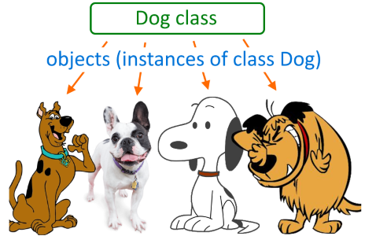
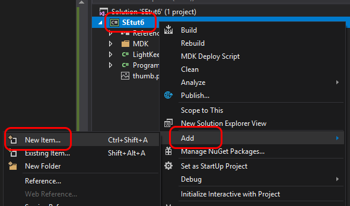
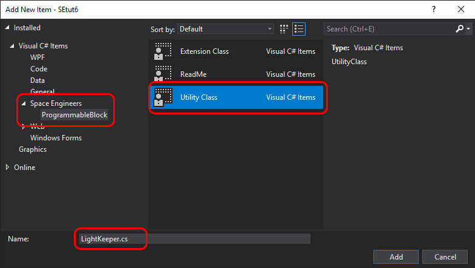
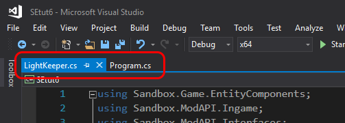
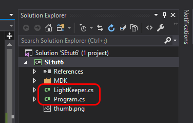

Now that we have an idea how to make a "wavy" runway, we can look at how we can improve the code so it is easier to maintain (fix or tweak) and update (add new features).
There is a great way to simplify the code by "encapsulating" logic and certain variables into separate units.
"Encapsulation" means isolating logic and variables from the rest of the program.

We are talking about Classes.
We've seen classes before.
`Program` is a class (because it literally says `class Program`).
It has class variables (also called properties) and methods (also called behaviors).
It also has a constructor.

Reminder - an object is an instance of a class that can be obtained by instantiating a class using the `new` keyword and calling the class's constructor, like `MyObjectClass myObject = new MyObjectClass()`.
Also, classes can be seen as templates which are used to create objects (instances of classes).
One class can be used to create many objects, and all those objects will have their own copies of properties (variables) and behaviors (methods).

<div style="text-align:center"></div>

So, let's create a new project `SEtut6` and copy the program we've got in the `SEtut5` project into the new project.
Now, let's see what we can extract from the existing program that seems to be closely associated.
Looks like lights by certain index in the `lights` list directly depend on the increments in the `increments` list by the same index.
Meaning, a light with index 1 depends on the increment by index 1, light by index 2 depends on increment by index 2 and so on.
We've got a winner!

Let's encapsulate a light and its corresponding increment into a class.
To do that we need to first create a new class.
To avoid creating a pile of code all in one file (that would be hard to navigate and find things in) we will create the new class in a separate file.

Reminder - we have MDK extension installed in Visual Studio.
MDK extension was created to make it easier to develop SE scripts.
MDK introduces two new kinds of classes that are not in C# itself and are specific to scripts in SE. Those MDK-specific classes are "Utility class" and "Extension class".
The kind of class we need is Utility class.

Let's create a new MDK Utility class and call it `LightKeeper`, it'll handle everything that has to do with lights for us.
Follow the pictures below to create `LightKeeper` class.
First, right click on the `SEtut6` project in the right panel, then select `Add` in the popup menu and click `New Item` in another popup menu.



In the window that shows up select `Space Engineers > ProgrammableBlock` section, select `Utility Class` and enter file name `LightKeeper.cs`.



The result of that would be a new file `LightKeeper.cs` that would be opened in a new tab along the original `Program.cs`



and the same file will show up in the "Solution Explorer" on the right.



We are going to add something to the `LightKeeper` class and we don't care much about everything else that it is wrapped in.
That everything else should be still there, but we will omit it in the following code snippets for brevity.

Here is the `LightKeeper` class.

```csharp
public class LightKeeper
{

}
```

That's it, that's all it takes to create a new class.
Of course it doesn't do much right now. In fact, it doesn't do anything yet.
So, let's fix that.

As we established earlier, the things that we want to move to the class are the light itself and the increment that will be used to update the light's color.
So, declare a class variable named `light` of type `IMyInteriorLight` and another class variable named `increment` of type `int` in our new class `LightKeeper`.

We can assign initial value to the `increment` variable right where it is declared, which would look like `int increment = 2;`.
It is a little more complicated with the light as we don't have that object upfront.
In order to set the `light` we will need to declare a constructor in that class that takes a parameter of type `IMyInteriorLight`.
As you remember, constructors are methods that are named exactly as the class they are in.
This means that we need to declare a method named `LightKeeper` that takes one parameter of type `IMyInteriorLight`.
Inside that constructor we will assign the light passed as a parameter to the class variable `light`. The constructor would look like below.

```csharp
public LightKeeper(IMyInteriorLight alight)
{
    light = alight;
}
```

Back in the `Program.cs` file we can make some changes now.
We no longer need the `lights` list as a class variable there as each of the lights will belong to its keeper instead.
Move the `lights` list to the beginning of the constructor instead.
We also no longer need `increments` list for the same reason, just delete it.
We need a new list that will hold all the `LightKeeper`s.
It shouldn't be a problem for you to declare that list by yourself.
Then, in constructor, we still need the code that does the following (leave as it is):
- set up `UpdateFrequency`
- get the `Runway Lights` group
- populate the moved `light` list with the lights from the group
- sort the `lights` list
- leave only one line of lights in the `lights` list and filter out the rest (`lights = lights.Where((x, i) => i % 2 == 0).ToList()`)
- declare `currentColorValue` variable

Then, the first loop that initially went over all the lights and set the initial wave, will need a small addition.
Since we need to encapsulate lights into their corresponding `LightKeeper`s and we already have a loop that goes over all the lights, we can create the `LightKeeper`s right in that loop.
So, first, let's create a `LightKeeper` for each of the lights and add them to the `keepers` list.

```csharp
LightKeeper keeper = new LightKeeper(light);
keepers.Add(keeper);
```

Since all the `increments` were consumed by the `LightKeeper` instances and we removed that `increments` list, we no longer need that second loop in the `Program` constructor that populated `increments` list.

It already starts to clean up the code a little bit.
But the best part is ahead.

Most of the logic (which is implemented with code) that updates lights' colors in the `Main` method needs to migrate to the `LightKeeper` class as that is what it was created for in the first place.
But, that code first needs a place to stay.
So, in the `LightKeeper` class create a method called `tick` that takes no arguments and returns no type (i.e. returns `void`) and in the body of that method implement the following pseudo-code.

```csharp
// Declare variable 'red' (integer) and assign it the value of the red component of the
// 'light' like was done in part 5. Here is the the needed code in case you forgot.
int red = light.Color.R;

// Do checks for the 'red' component to stay within the range and update the 'increment'
// class variable accordingly. The checks are exactly the same as in the loop in the
// 'Main' method.

// Now it's time to update the 'red' component by adding 'increment' just like it was
// done in the 'Main' method.

// So, the checks are done, 'increment' is adjusted and the 'red' component has its
// next value. Now we can create a new color with both 'red' and 'blue' components
// (remember that blue component can be easily calculated from the value of the 'red'
// component) and assign it back to the 'light' like it was done in the 'Main' method.
```

Ok, good, now the best part!
Since the logic that keeps track of the increment of a particular light sits together with the light itself in `LightKeeper` objects, the only thing left to do is to call the `tick` method on every `LightKeeper` object.
Since we only need to go over every element of the `keepers` list and no longer need any index in the `Main` method, we can replace everything in the `Main` method with a simple `foreach` loop. We need to do exactly what was done in [part 2, First script](02-first-script), except the list is `keepers` in this case and the type of the variable would be `LightKeeper`.
Of course it makes sense to name that loop variable `keeper` instead of `light` too.
Then in the body of the `foreach` loop we only need to call method `tick` on the `keeper` object.

And that is it!

Let's go through everything one more time to make sure there is nothing left not understood.

In the `Program` constructor we do the following:
- find all the lights
- set each of the light's initial color to form initial "wave"
- create `LightKeeper` objects to hold each of the lights together with their corresponding increments
- add all keepers to the `keepers` list to iterate through on every tick

In the `LightKeeper` constructor we only assign the class's variable `light` the object that is passed to that constructor as an argument.
That makes it possible to do something with that light every time the `tick` method is called.

In the `tick` method we do the following:
- check whether the red component is still in range
- in case red component is out of range we negate the `increment` class variable
- add `increment` to the red component
- find blue component based on the value of red component
- apply new color to the `light` using the calculated red and blue components

In the main method we only go through every keeper and call their `tick` methods.

Enjoy the still working colorful waves 😃


