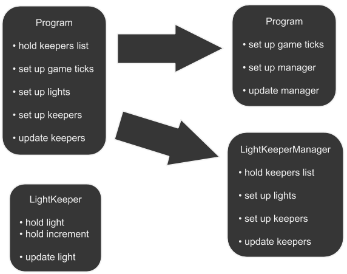

Great work with encapsulation in [part 6](06-advanced-colorful-runway-objects-rule)! Keep it up!

Let's recap what we've done in part 6:
- Created `LightKeeper` class.
- Created a separate instance of `LightKeeper` for each of the lights (reminder - instance of a class is also called `object`).
- Each `LightKeeper` object has a light and an increment that is used to update that light's color.
- Each `LightKeeper` object also has method `tick` with all the logic to update its light's color - add/subtract `2` to/from red/blue components of the light's color.
- Set up a `foreach` loop in the `Main` method to call `tick` method on each of the `LightKeeper` objects so they perpetually change light's color from red to blue and back.
- We also did initial set up of all the lights to form initial wave. In other words, the line of the lights initially has gradually changing color from red at the beginning of the line to blue at the end.

In the next part of the tutorial (part 8) we will do some other cool stuff, but we need to prepare for it first.
We now have `LightKeeper`s that do all the dirty work for us, but we still have that ugly set up code that sets initial wave in the `Program`'s constructor.

Here is a visualization of what we have right now vs what we want to get.

{: .center-image }

Clearly `Program` has too many responsibilities.
Let's extract some of the responsibilities into a separate class - `LightKeeperManager`. Its only responsibility will be to set up and manage `LightKeeper`s. That includes setting up the lights for the `LightKeeper`s.

That extraction will further clean up code.
It'll also structure the code, which is great for maintainability.

Below is the listing of what we've got so far.
Notes tell you what exactly needs to go away.

```csharp
// File Program.cs
namespace IngameScript
{
    partial class Program : MyGridProgram
    {
        // We want to extract the "for" loop from the constructor.
        // Since it uses there variables, they must be extracted together with the loop.
        List<LightKeeper> keepers = new List<LightKeeper>();
        int ColorDiff = 255 / 24;
        // End of extracted variables.

        public Program()
        {
            List<IMyInteriorLight> lights = new List<IMyInteriorLight>();

            Runtime.UpdateFrequency = UpdateFrequency.Update1;
            IMyBlockGroup group = GridTerminalSystem.GetBlockGroupWithName("Runway Lights");
            group.GetBlocksOfType(lights);
            lights.Sort((x, y) => x.DisplayNameText.CompareTo(y.DisplayNameText));
            lights = lights.Where((x, i) => i % 2 == 0).ToList();

            // This is the ugly part that we want to extract.
            int red = 0;

            for (int index = 0; index < lights.Count; index = index + 1)
            {
                var light = lights[index];

                LightKeeper keeper = new LightKeeper(light);
                keepers.Add(keeper);

                int blue = 255 - red;

                Color currentColor = new Color(red, 0, blue);
                light.Color = currentColor;

                red = red + ColorDiff;
            }
            // End of the ugly part to extract.
        }

        public void Main(string argument, UpdateType updateSource)
        {
            // This loop will also get extracted as there will
            // be no "keepers" list in this class any more.
            foreach (LightKeeper keeper in keepers)
            {
                keeper.tick();
            }
            // End of extracted loop.
        }
    }
}
```

```csharp
// File LightKeeper.cs
namespace IngameScript
{
    partial class Program
    {
        public class LightKeeper
        {
            IMyInteriorLight light;
            int increment = 2;

            public LightKeeper(IMyInteriorLight alight)
            {
                light = alight;
            }

            public void tick()
            {
                int red = light.Color.R;

                if (red <= 0)
                {
                    increment = 2;
                }

                if (red == 254)
                {
                    increment = -2;
                }

                red = red + increment;
                int blue = 255 - red;
                light.Color = new Color(red, 0, blue);
            }
        }
    }
}
```

Create a new project like you did before and call it `SEtut7`.
Copy and replace the contents of the `Program.cs` file with the listing from above (leave the `using` statements as they are in your new project).
Create a new utility class `LightKeeper` as you did in part 6 and copy and replace the contents with the listing from above (same note on `using`).

Now we need to create another utility class where the extracted code will live. Name it `LightKeeperManager`. Here is everything we need to do with the listing above:
- Extracted class variables must be moved to `LightKeeperManager` also as class variables.
- Code extracted from the `Program`'s constructor must be moved to `LightKeeperManager`'s constructor (you will need to create it first, of course; you've done that before in `LightKeeper` class). `LightKeeperManager`'s constructor must take one argument - a list of `IMyInteriorLight` type. Name that argument `lights` so the code could migrate without change.
- Create method `tick` in `LightKeeperManager` class. That method should have no return type and take no arguments, just like the one in `LightKeeper` class. Move `foreach` loop from `Program`'s `Main` method to that new `tick` method in `LightKeeperManager` class.

Now `Program.cs` file looks deserted.

Since most of the code has been moved to `LightKeeperManager`, we need to use it somehow.

Follow the notes in the listing below to implement what's missing. Read the explanations that follow the listing.

```csharp
// File Program.cs
namespace IngameScript
{
    partial class Program : MyGridProgram
    {
        // Declare a class variable of type LightKeeperManager and call it "manager".

        public Program()
        {
            List<IMyInteriorLight> lights = new List<IMyInteriorLight>();

            Runtime.UpdateFrequency = UpdateFrequency.Update1;
            IMyBlockGroup group = GridTerminalSystem.GetBlockGroupWithName("Runway Lights");
            group.GetBlocksOfType(lights);
            lights.Sort((x, y) => x.DisplayNameText.CompareTo(y.DisplayNameText));
            lights = lights.Where((x, i) => i % 2 == 0).ToList();

            // Assign "manager" a new instance of LightKeeperManager class.
        }

        public void Main(string argument, UpdateType updateSource)
        {
            // Call "tick" method on "manager" object.
        }
    }
}
```

Well, in place of the code that was moved from `Program`'s constructor, we need to create an instance of `LightKeeperManager` using its constructor.
Remember that `LightKeeperManager` requires an argument? Good that we still have that `lights` list in `Program`'s constructor, so pass it to the `LightKeeperManager`'s constructor as the argument it requires.

Good.
`LightKeeperManager` object sets up initial wave now.
But what about that empty `Main` method in `Program` class?
It does nothing and, inherently, the whole script does nothing.
Remember, method `Main` is where the `foreach` loop that called `tick` on all the keepers used to live.
Since that `foreach` loop has been moved to `LightKeeperManager`'s `tick` method, we only need to call that one method in `Main` method.
But wait, we don't have `LightKeeperManager` object assigned to any variable, so we don't have access to the `LightKeeperManager` object we created before.

Fear not.
Let's just declare a new class variable of type `LightKeeperManager` and name it `manager`.
That new class variable should be declared in `Program` class (`Program.cs` file).
Then, assign that variable the object that we created in `Program`'s constructor (the one of type `LightKeeperManager`).

Now, back to the `Main` method. We now have `manager` object that is accessible in the `Main` method, so all that's left to do is to call `manager`'s `tick` method and we are done.

Ask MDK to deploy a new script, copy it as usual and paste into PB in SE.
Check that everything still works.

Great job! You deserve a cookie 😃
