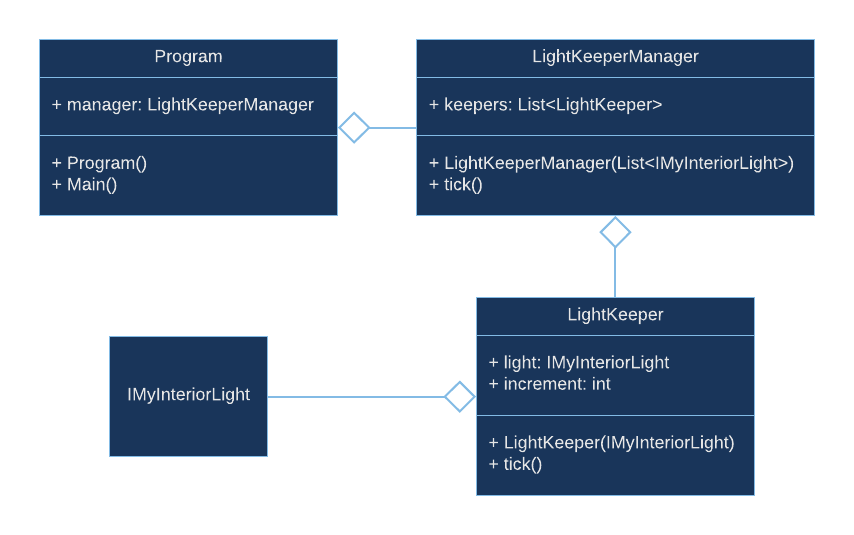
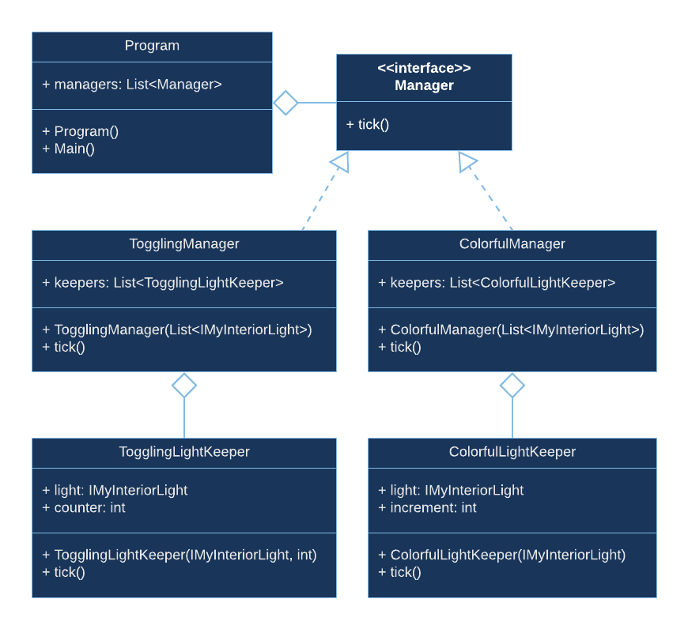

# 08. Mixed runway demo or "Interfaces to the rescue!"

Let's say we've decided to sell different models of runways.
So far we've got two models: the very first one, where the lights were only toggled on and off, and the latest - colorful model.

In order to make good impression about the product and the business we need to go an extra mile.
That extra mile for us will be not only to demonstrate that both options work, but also that the system we've built is quite flexible.

The flexibility will be embodied in ability to compose different kinds of light handling on a single runway.
Specifically, we will need one line of lights to work in toggling mode and the other - in colorful mode.

Current state of our program is already composed of multiple classes, which makes it quite easy to refactor for our demo needs.
But there is one component that is still missing.

In order to be able to easily compose lights working in different modes we will need two different managers implement different logic based on the mode, but still have a `tick` method that would be called in the `Main` method.
Moreover, we will not have different variables for different managers, as that won't be flexible. Instead we will have only one list with both managers.

"But how can we make one list to contain different types (different managers)?", you may ask.

There is a very convenient way to accomplish the flexibility we need - interfaces.

`Interface` is quite simple, but powerful concept.
It allows different classes that implement a particular interface, to have different behavior, but be still treated exactly the same.

So, our list will contain a `Manager` type, which we will make an interface. That interface will declare only one method - `tick`. Then, both managers will implement that interface by implementing the `tick` method. And that is it!

The diagram depicting the new structure is shown below.

