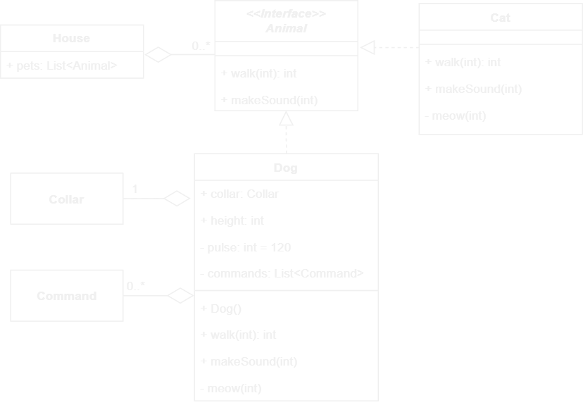
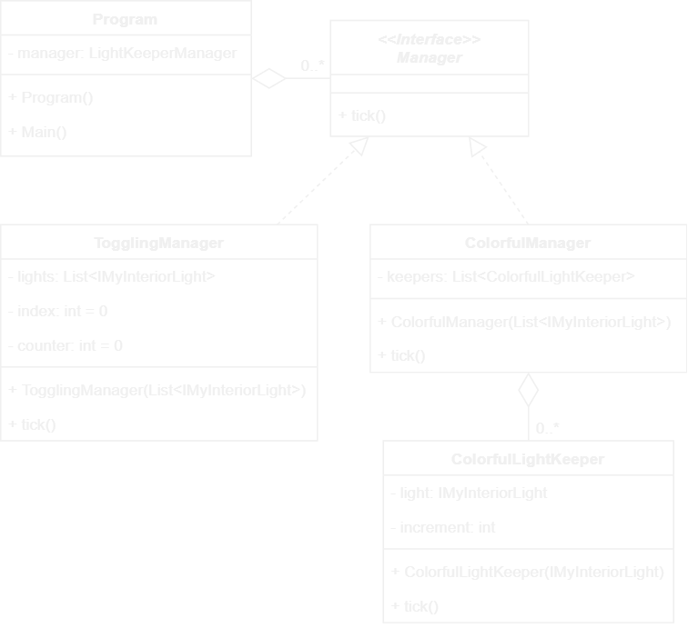
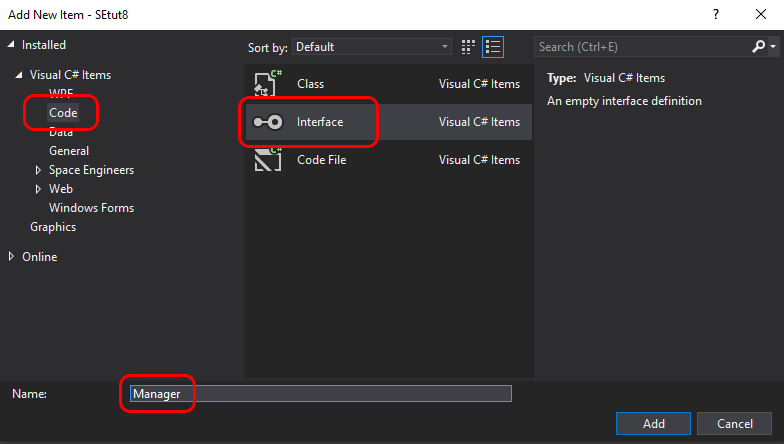

# 08. Mixed runway demo or "Interfaces to the rescue!"

Let's say we've decided to sell different models of runways.
So far we've got two models: the very first one, where the lights were only toggled on and off, and the latest - colorful model.

In order to make good impression about the product and the business we need to go an extra mile.
That extra mile for us will be not only to demonstrate that both options work, but also that the system we've built is quite flexible.

The flexibility will be embodied in ability to compose different kinds of light handling on a single runway.
Specifically, we will need one line of lights to work in toggling mode and the other - in colorful mode.

We're going to discuss the current structure of the code and what needs to change.
The best way to discuss code structure is by referencing to UML diagrams.

## UML class diagrams

UML diagrams are de facto standard for depicting software structure.
There are different kinds of UML diagrams.
The one we are going to use is called "class diagrams".

Here is an example of UML class diagram.



Each of the blocks in the diagram is called "class", because they represent classes in the code.

There are several kinds of class blocks in UML.
In the example diagram above we can see blocks with different number of sections.
They are all still classes.
The difference is that it wasn't important what is in the `Collar` or `Command` classes, so all the sections were omitted except the __mandatory__ one - the __name section__.

When __two sections__ are present in a class block, the first section always has the name of the class and the second section always has class variables.

When __three sections__ are present in a class block, the first two sections are the same as in the two-section block and the third section always has methods.

__Class variables__ are defined in the following way:
- access sign _(optional)_: `+` for public access (like for `collar` in `Dog`), `-` for private access (like for `pulse` in `Dog`), or omitted if it isn't important; in the example all variables are public
- variable name: like `collar` in class `Dog`
- type: like `Collar` for the `collar` variable in class `Dog`
- default value _(optional)_: like `120` for `pulse` in class `Dog`

__Methods__ are defined as follows:
- access sign _(optional)_: same as for class variables
- method name: like `bark` in class `Dog`
- argument types in parentheses _(optional, comma separated)_: like `int` in method `bark` in class `Dog`; if none, then empty parenthesis, like method `Dog` in `Dog` class (which is also a constructor)
- return type _(optional)_: like `int` in method `walk` in class `Dog`; method `bark` in class `Dog` doesn't have return type (i.e. `void`), so doesn't method `Dog` as it is a constructor

There are also two kinds of connections between classes in the example.

The __diamond connection__ represents _aggregation_.
Aggregation means that instance of one class can be contained in instance of another class.
In the example, an instance of class `Collar` is contained in class `Dog` in variable `collar`.

The __numbers on the other end of aggregation connection__ tells how many instances can be contained.
In the example there can be only one instance of class `Collar` in class `Dog`.
There also can be zero or more instances of class `Command` in class `Dog`. Same for instances of `Animal` in class `House`.

The __empty arrow with dash line__ connection represents a _realization_.
That means that a class _realizes_ (or _implements_) an _abstract class_ or _interface_.
More on interfaces below.

## What we need to change

Current state of our program is already composed of multiple classes, which makes it quite easy to refactor for our demo needs.
But there is one component that is still missing.


In order to be able to easily compose lights working in different modes we will need two different managers implement different logic based on the mode, but still have a `tick` method that would be called in the `Main` method.
Moreover, we will not have different variables for different managers, as that won't be flexible. Instead we will have only one list of managers and both managers will be added there.

"But how can we make one list to contain different types (different managers)?", you may ask.

There is a very convenient way to accomplish the flexibility we need - _interfaces_.

`Interface` is quite simple, but powerful concept.
It allows different classes that implement a particular interface, to have different behavior, but be still treated exactly the same.

So, our list will contain a `Manager` type, which we will make an interface. That interface will declare only one method - `tick`. Then, both managers will implement that interface by implementing the `tick` method. And that is it!

The diagram depicting the new structure is shown below.



The diagram communicates two important statements:
1. Any class that implements interface `Manager` can be added to the list `managers` in class `Program`.
2. It is possible to call method `tick` on any object that is in list `managers` in class `Program`.

So, let's get to it.

First, let's add an interface and name it `Manager`.



Next, declare method `tick` without return type and without arguments.
Two things to remember about methods declared in an interface:
- they can never have body
- they can never have access specified (e.g. `public` or `private`).

Here is the result:

```csharp
namespace IngameScript
{
    interface Manager
    {
        void tick();
    }
}
```

Next, rename class `LightKeeper` to `ColorfulLightKeeper` everywhere.
The easiest way to do that:
1. select `LightKeeper`'s name anywhere in the code
2. click button `F2`
3. type new name - `ColorfulLightKeeper`
4. click `Enter`

After that we need to rename class `LightKeeperManager` to `ColorfulManager` the same way.

Now we are ready to create other light keepers and managers.

So, create utility classes `TogglingLightKeeper` and `TogglingManager` as described in the last diagram.
That includes all class variables and methods.

Remember that both managers need to implement interface `Manager`?
Let's do this.

A class can extend another class or implement an interface by specifying the name of the other class/interface after its own name separated by colon.
In the case of `TogglingManager` it would look like the following

```csharp
public class TogglingManager : Manager
```

and for `ColorfulManager`

```csharp
public class ColorfulManager : Manager
```

Let's now make `TogglingLightKeeper` useful.
