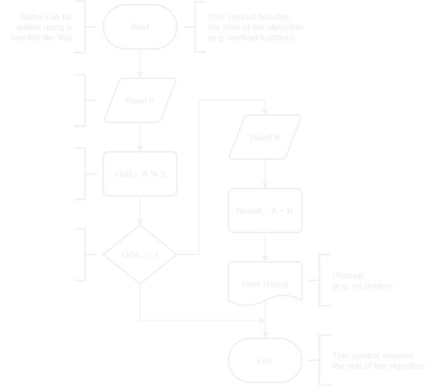
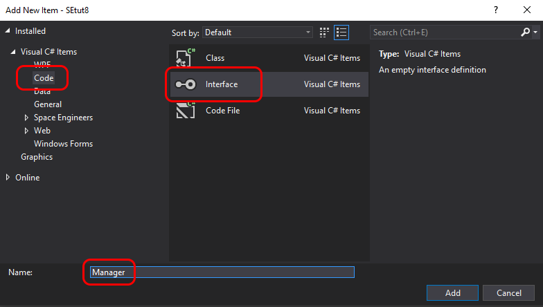

All right, so now have a nice demo for prospective customers.
In fact, our demo at the exhibition was very popular and we've got great demand for our product!

Together with the orders we've got quite a lot feature requests.
Many of the features requested were to do with how granularly our software can handle sets of lights.
Actual runways can be much longer than our 24-light long demo runway.
So, some customers requested our software to handle four different sets of lights at the same time.
And that is, of course, also includes different kinds of light `Manager`s, ranging from simple `Blinking Manager` to complex managers that can handle series of runway behaviors.

Before getting into much details on the series of behaviors, let's first think about how we could split lights of one runway into more than two lines.
The simplest way would be to divide our existing two lines of lights in two halves, which means we will have four quarters.

So, here is the problem we need to solve: out of the 48 lights we have in the demo runway we need to produce four lines of lights, each of which will be handled by a separate `Manager`.

So far, we've communicated algorithms via regular sentences and pseudo-code.
Our algorithms are getting more sophisticated and harder to communicate in words (or, more precisely, understood from words).
Thankfully, there is a better way that has been practiced for decades - flowcharts.

## Flowcharts

Here is an example of a simple flowchart depicting a method/function that reads two integers (from keyboard, for instance) and prints out their sum.



Let's break it down.

At the very top we can see a `Start` symbol.
That symbol means the start of the algorithm.
In actual code that is usually the very beginning of a method's body.

There are also two notes on the left and on the right from the `Start` symbol.
We can add any kinds of notes this way, for instance, to add a description what is being done using particular symbol, how, or why.
Notes are optional.

Right after the `Start` symbol we can see an `Input/Output` symbol.
It is called `Input/Output` because it can it can mean input operation (e.g. capturing keyboard strokes), output operation (e.g. displaying information) or both.
In the example, that symbol reads some value (hence means just `Input`) and assigns it to variable named `A`.

You probably noticed the arrow that connects `Start` with `Input/Output`.
That defines the direction the algorithm goes - strictly according to where the arrow points.

Next, we can see a `Process` symbol which is the place where we can execute any kind of operations.
In the example we have variable named `Odd` assigned the remainder of integer division.
We'll see explanation of that operation later in this tutorial.

After the `Process` symbol follows `Decision` symbol.
In actual code that is usually implemented by the `if` statement.
The condition defines which direction the algorithm goes.
In the example, the algorithm ends if variable `Odd` is equal to `1`, which tells us that the whole algorithm actually does something useful only when value of variable `A` is an even number.

> Note that numbers being used in the example algorithm are assumed to be integers, but they can as well be decimals. Applying common sense is advised.

So, given variable `A` is an even number, the algorithm proceeds with reading a value and assigning it to a variable named `B` using another `Input` block.

Then, a `Process` follows that finds the sum of `A` and `B` and assigns the result to variable named `Result`.

Then the `Result` variable is printed out (e.g. using a printer) and the algorithm ends.

## Solving the problem

Now that we know how to read flowcharts, let's put that in practice.

For convenience, here is the problem statement.

> Out of the 48 lights we have in the demo runway we need to produce four lines of lights, each of which will be handled by a separate `Manager`.

That means that solution must produce four `List`s of `IMyInteriorLight`.

Let's look at how the lights are arranged on the runway.


Here is the algorithm that needs to be implemented 


Here is an example of UML class diagram.


Each of the blocks in the diagram is called "class", because they represent classes in the code.

There are several kinds of class blocks in UML.
In the example diagram above we can see blocks with different number of sections and different decorations.
They are all still classes.
The difference in sections is that it wasn't important what is in the `Collar` or `Command` classes, so all the sections were omitted except the __mandatory__ one - the __name section__.
Also, `<<Interface>>` is a special kind of class and usually only has methods.

When __two sections__ are present in a class block, the first section always has the name of the class and the second section always has class variables..

When __three sections__ are present in a class block, the first two sections are the same as in the two-section block and the third section always has methods.

__Class variables__ are defined in the following way:
- access level _(optional)_: plus sign (`+`) for public access (e.g. for `collar` in `Dog`), minus sign (`-`) for private access (e.g. for `pulse` in `Dog`), or omitted if it isn't important
- variable name: e.g. `collar` in class `Dog`
- type: e.g. `Collar` for the `collar` variable in class `Dog`
- default value _(optional)_: e.g. `120` for `pulse` in class `Dog`

__Methods__ are defined as follows:
- access level _(optional)_: same as for class variables
- method name: e.g. `bark` in class `Dog`
- argument types in parentheses _(optional, comma separated)_: e.g. `int` in method `bark` in class `Dog`; if none, then empty parenthesis, e.g. method `Dog` in `Dog` class (which is also a constructor)
- return type _(optional)_: e.g. `int` in method `walk` in class `Dog`; method `bark` in class `Dog` doesn't have return type (i.e. `void`), so doesn't method `Dog` as it is a constructor

There are also two kinds of connections between classes in the example.

The __diamond connection__ represents _aggregation_.
Aggregation means that instance of one class can be contained in instance of another class.
In the example, an instance of class `Collar` is contained in `Dog` in variable `collar`.

The __numbers on the other end of aggregation__ connection tells how many instances may be contained.
In the example there can be only one instance of class `Collar` in `Dog`.
There also may be zero or more instances of class `Command` in `Dog`. Same for instances of `Animal` in `House`.

The __empty arrow with dash line__ connection represents a _realization_.
That means that a class _realizes_ (or _implements_) an _abstract class_ or _interface_.
Notice how both classes that implement interface `Animal` have the same methods the interface has.
That is because they must implement methods that are declared in interface.
More on interfaces below.

## What we need to change

First, let's create a new project and name it `SEtut8`.
Then, create all the same classes as we had in project `SEtut7` and copy their contents.

Current state of our program is already composed of multiple classes, which makes it quite easy to refactor for our demo needs.
But there is one component that is still missing.


In order to be able to easily compose lights working in different modes we will need two different managers implement different logic based on the mode, but still have a `tick` method that would be called in the `Main` method.
Moreover, we will not have different variables for different managers, as that won't be flexible. Instead we will have only one list of managers and both managers will be added there.

"But how can we make one list to contain different types (different managers)?", you may ask.

There is a very convenient way to accomplish the flexibility we need - _interfaces_.

`Interface` is quite simple, but powerful concept.
It allows different classes that implement a particular interface, to have different behavior, but still be treated exactly the same.

So, our list will contain a `Manager` type, which we will make an interface. That interface will declare only one method - `tick`. Then, both managers will implement that interface by implementing the `tick` method. And that is it!

The diagram depicting the new structure is shown below.


The diagram communicates two important statements:
1. Any class that implements interface `Manager` can be added to the list `managers` (class `Program`).
2. It is possible to call method `tick` on any object that is in list `managers` (class `Program`).

So, let's get to it.

First, let's add an interface and name it `Manager`.



Next, declare method `tick` without return type and without arguments.
Two things to remember about methods declared in an interface:
- they can never have body
- they are usually public.

Here is the result:

```csharp
namespace IngameScript
{
    interface Manager
    {
        void tick();
    }
}
```

Next, rename class `LightKeeper` to `ColorfulLightKeeper` everywhere.
The easiest way to do that:
1. select `LightKeeper`'s name anywhere in the code
2. click button `F2`
3. type new name - `ColorfulLightKeeper`
4. click `Enter`

After that we need to rename class `LightKeeperManager` to `ColorfulManager` the same way.

Now we are ready to create `TogglingManager`.
So, create utility class `TogglingManager` as described in the last diagram.
That includes all class variables and methods.

Remember that both managers need to implement interface `Manager`?
Let's do this.

A class can extend another class or implement an interface by specifying the name of the other class/interface after its own name separated by colon.
In the case of `TogglingManager` it would look like

```csharp
...
public class TogglingManager : Manager
...
```

and for `ColorfulManager`

```csharp
...
public class ColorfulManager : Manager
...
```

Let's now make `TogglingManager` useful.

First of all, did you assign the list of lights that is passed as an argument to the `TogglingManager`'s constructor to the private class variable `lights`?
If not, do that.
Then, we need to disable all the lights in the line first.
Remember that constructor of an object is executed only once - when object is created.
That makes constructor the perfect place to disable all the lights when the script starts. We did that before in [part 2](02-first-script), but in different class.

Then, according to how it was done in [part 2](02-first-script), we need to toggle the light that is pointed to by the `index` class variable.
After that `index` must be incremented.

To prevent `index` from exceeding number of elements in list `lights`, we need to do the same thing with `index` as we did in [part 2](02-first-script).

Ok, looks like toggling should be fine now. Let's refactor class `Program` to support multiple managers.

According to the diagram, class `Program` should have class variable `managers` as a list of type `Manager`.
What UML diagrams don't show is the actual implementation, because from the diagram's standpoint it is not important.
But it is important from PB's standpoint.

Remember that no variable can be used until it has value (line `int`) or references an object (like `List`)?
So, create a list (in other words, create an instance) of corresponding type and assign it to variable `managers`.
We can do that right where the list is declared or in constructor, but before it is referenced anywhere in the code.

Here is the code for the constructor. Replace whatever it has now.

```csharp
public Program()
{
    Runtime.UpdateFrequency = UpdateFrequency.Update1;

    List<IMyInteriorLight> lights = new List<IMyInteriorLight>();
    IMyBlockGroup group = GridTerminalSystem.GetBlockGroupWithName("Runway Lights");
    group.GetBlocksOfType(lights);
    lights.Sort((x, y) => x.DisplayNameText.CompareTo(y.DisplayNameText));

    List<IMyInteriorLight> line1 = lights.Where((x, i) => i % 2 == 0).ToList();
    List<IMyInteriorLight> line2 = lights.Where((x, i) => i % 2 == 1).ToList();

    managers.Add(new ColorfulManager(line1));
    managers.Add(new TogglingManager(line2));
}
```

Now, in method `Main` we need to iterate over all managers in list `managers` and call method `tick` on each of the managers.

Let's check if the script works at this point.

If you've got an error in PB, check that the loop variable in method `Main` is of type `Manager`.
If it is of any of the concrete types, then we get an error like "Unable to cast object of type TogglingManager to type ColorfulManager".
That is because in list `managers` we have two managers of completely different types (they don't extend each other).
But they are both of type `Manager` as they both implement that interface.

Fix all the issues you might have and let's adjust the script a little bit.

Have you noticed how fast the toggling line goes?
That is because in [part 2](02-first-script) we toggled lights only _every 10 game ticks_ according to how script ticks were set up in constructor.
But in this version we have script ticks set to _every game tick_.

If we simply change it to _every 10 game ticks_, then the colorful line would change its color so slow that we would barely notice the change.

This is where the variable `counter` in `TogglingManager` comes to play.
We should use it to count ticks and only toggle lights and increment `index` when `counter` has reached certain value, let's say every 5 game ticks.
In order for that to ever happen, `counter` needs to be incremented by 1 every time method `tick` is called.
It also needs to be reset to 0 every time it reaches that set value.

So, compile the script and check in PB again. Both lines should now go at normal pace.
