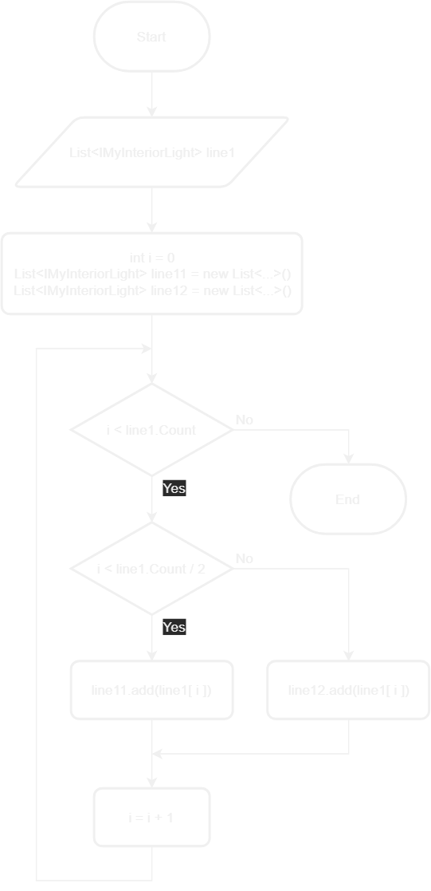

All right, so now have a nice demo for prospective customers.
In fact, our demo at the exhibition was very popular and we've got great demand for our product!

Together with the orders we've got quite a lot feature requests.
Many of the features requested were to do with how granularly our software can handle sets of lights.
Actual runways can be much longer than our 24-light long demo runway.
So, some customers requested our software to handle four different sets of lights at the same time.
And that is, of course, also includes different kinds of light `Manager`s, ranging from simple `Blinking Manager` to complex managers that can handle series of runway behaviors.

Before getting into much details on the series of behaviors, let's first think about how we could split lights of one runway into more than two lines.
The simplest way would be to divide our existing two lines of lights in two halves, which means we will have four quarters.

So, here is the problem we need to solve: out of the 48 lights we have in the demo runway we need to produce four lines of lights, each of which will be handled by a separate `Manager`.

So far, we've communicated algorithms via regular sentences and pseudo-code.
Our algorithms are getting more sophisticated and harder to communicate in words (or, more precisely, understood from words).
Thankfully, there is a better way that has been practiced for decades - flowcharts.

## Flowcharts

Here is an example of a simple flowchart depicting a method/function that reads two integers (from keyboard, for instance) and prints out their sum.

{: .center-image }

Let's break it down.

At the very top we can see a `Start` symbol.
That symbol means the start of the algorithm.
In actual code that is usually the very beginning of a method's body.

There are also two notes on the left and on the right from the `Start` symbol.
We can add any kinds of notes this way, for instance, to add a description what is being done using particular symbol, how, or why.
Notes are optional.

Right after the `Start` symbol we can see an `Input/Output` symbol.
It is called `Input/Output` because it can mean input operation (e.g. capturing keyboard strokes), output operation (e.g. displaying information) or both.
In the example, that symbol reads some value (hence means just `Input`) and assigns it to variable named `A`.

You probably noticed the arrow that connects `Start` with `Input/Output`.
That defines the direction the algorithm goes - strictly according to where the arrow points.

Next, we can see a `Process` symbol which is the place where we can execute any kind of operations.
In the example we have variable named `Odd` assigned the remainder of integer division.
We'll see explanation of that operation later in this tutorial.

After the `Process` symbol follows the `Decision` symbol.
In actual code that is usually implemented by the `if` statement.
The condition defines which direction the algorithm goes.
In the example, the algorithm ends if variable `Odd` is equal to `1`, which tells us that the whole algorithm actually does something useful only when value of variable `A` is an even number.

> Note that numbers being used in the example algorithm are assumed to be integers, but they can as well be decimals. Applying common sense is advised.

So, given variable `A` is an even number, the algorithm proceeds with reading a value and assigning it to a variable named `B` using another `Input` block.

Then, a `Process` follows that finds the sum of `A` and `B` and assigns the result to variable named `Result`.

Then the `Result` variable is printed out (e.g. using a printer) and the algorithm ends.

## Solving the problem

Now that we know how to read flowcharts, let's put that in practice.

For convenience, here is the problem statement.

> Out of the 48 lights we have in the demo runway we need to produce four lines of lights, each of which will be handled by a separate `Manager`.

That means that solution must produce four `List`s of `IMyInteriorLight`.

Let's look at how the lights are arranged on the runway.

{: .center-image }

As we can see, the lights are arranged in pairs and according to their names (i.e. "Light 01", "Light 02", ...).

First, we're going to implement the algorithm to arrange two lines of lights into two lists.

Let's replace contents of `Program`s constructor with the following.

```csharp
Runtime.UpdateFrequency = UpdateFrequency.Update1;

List<IMyInteriorLight> lights = new List<IMyInteriorLight>();
IMyBlockGroup group = GridTerminalSystem.GetBlockGroupWithName("Runway Lights");
group.GetBlocksOfType(lights);
lights.Sort((x, y) => x.DisplayNameText.CompareTo(y.DisplayNameText));
```

This gives us one list of lights sorted by their names. Since it's sorted, there is the following mapping between indexes in the list and lights.

| index | light name   |
|-------|--------------|
| 0     | 01           |
| 1     | 02           |
| 2     | 03           |
| ...   | ...          |
| 46    | 47           |
| 47    | 48           |

We can disregard light names and instead address lights by their indexes.
In that case the indexes are arranged as follows.

{: .center-image }

Now, first line consists of lights with even index value and the second - with odd index value.

Here is the algorithm that needs to be implemented in order to arrange lines of lights into two separate lists.

{: .center-image }

Here is the explanation:
1. Get list of lights (already have that, but algorithm specifies that for clarity)
2. Declare variables and assign initial values
3. Make sure `i` is within index boundaries
4. If remainder from integer division of `i` by `2` is `0`, then add the light by index `i` to list `line1`, otherwise add to list `line2`
5. Increment `i`
6. Repeat from item 3

The result of that would be two lists populated with lights that belong to corresponding lines.

In practice (in actual code), in this specific case we would use `for` loop with corresponding initial value, condition and increment like we did before many times.

The remainder from integer division is quite simple concept - divide one integer by another integer and the remainder is the result we're interested in.
That operation is represented in C# with symbol `%` (percent sign).
Here's a few examples:

- `8 % 4 = 0` - the largest integer to be multiplied by `4` to produce result no greater than `8` is `2` and `4 * 2 = 8`, hence no remainder
- `8 % 5 = 3` - the largest integer to be multiplied by `5` to produce result no greater than `8` is `1` and `5 * 1 = 5`, hence remainder is `3`
- `8 % 6 = 2`
- `8 % 3 = 2` - the largest integer to be multiplied by `3` to produce result no greater than `8` is `2` and `3 * 2 = 6`, hence remainder is `2`

So, remainder from integer division of any number by `2` always produces remainder `0` for even numbers and remainder `1` for odd numbers.

Now, we need to split each of the lists in two halves to reach the ultimate goal - four `List`s of `IMyInteriorLight`

The algorithm to do that is also quite simple.

{: .center-image }

The algorithm above splits list `line1` into two lists `line11` and `line12`.
List `line2` can be split exactly the same way into `line21` and `line22`.

In order to avoid code duplication, let's create a method that implements the algorithm above.

```csharp
private List<IMyInteriorLight> splitInTwoHalves(
  List<IMyInteriorLight> srcList, 
  List<IMyInteriorLight> destList1, 
  List<IMyInteriorLight> destList2)
{
  // Add implementation here
}
```

The way parameters are supplied (on different lines) is something new to us, but semantically it is identical to having them on the same line.
The difference is that the line isn't too long and the code fits on page without the need to scroll left and right all the time.

When the algorithm is implemented in that new method, pass corresponding lists to it.

```csharp
splitInTwoHalves(line1, line11, line12);
splitInTwoHalves(line2, line21, line22);
```

Next, set up managers for each of the four lines.

```csharp
managers.Add(new ColorfulManager(line11));
managers.Add(new TogglingManager(line12));
managers.Add(new ColorfulManager(line21));
managers.Add(new TogglingManager(line22));
```

There is one problem with the ColorfulManager, though.
In case you didn't fix that in scope of [part 8](08-mixed-runway-demo), there is still `ColorDiff` class variable.
The problem with that variable is that it is calculated based on constant number of lights in the line - `24`.
To fix that problem, `24` must be replaced with the number of elements in the list.
However, that can't be done right where the variable is declared as it is unknown how many elements are in the list when variables are initialized.
Taking into account that `ColorDiff` is only needed in the constructor upon initialization of the line, then we can move that variable into constructor and use the number of elements in the list of lights that is passed instead of constant `24`.

Once that is done, try the script in the game.

Great job!
