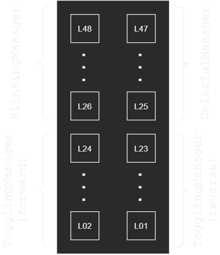
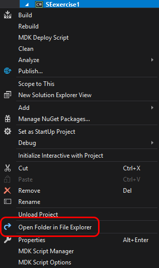
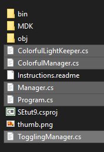
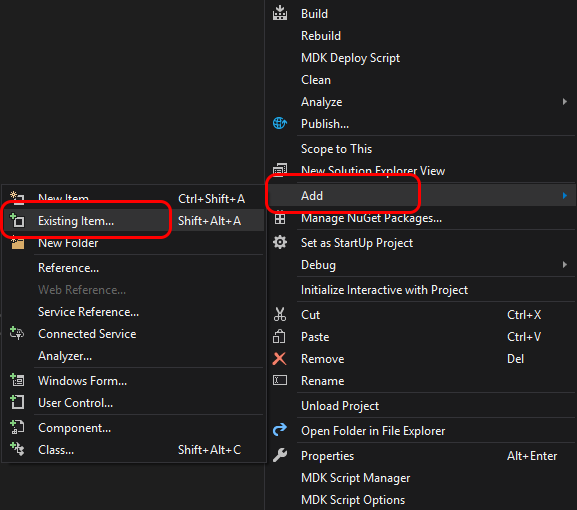

Now that we have the runway lights split into four lists, we can set up the duplicated Managers in different ways.

> Hint: make sure to check tips below

Here is how complete exercise should look like.

{: .center-image }

Here is the schematics of how you need to set up the lights.

{: .center-image }

We already have ColorfulManager and TogglingManager (forward).
To complete the task you need to do the following:
- create `BlinkingManager` with corresponding behavior
- feed second `TogglingManager` a reversed list of lights

You need to come up with an algorithm for `BlinkingManager`.
You have enough examples with explanations on how to make a manager with a behavior.

`BlinkingManager` should have the following behavior:
1. Enable all lights in its list
2. Wait one second
3. Disable all lights in its list
4. Wait one second
5. Repeat from item 1 indefinitely

You will also need to figure out how to get a reversed list of lights for the second `TogglingManager`.

# Tips

## How to make a copy of `Visual Studio` project

To make a copy of a `Visual Studio` project, you need to:
1. create a new project (for this exercise name it `SEexample1`)
2. find new project's folder (see below)
3. find old project's folder (see below)
4. select necessary `.cs` files in the old project's folder and copy them to the new project's folder
5. add new files to the new project

### Find project's folder

To find a project's folder, open the project in `Visual Studio`, right-click on the project in the right panel and select `Open Folder in File Explorer`.

{: .center-image }

Same applies to both projects - new and old.

### Select and copy necessary files

You will usually need to select all files with `.cs` extension in the old project (which you want to make copy of). Here is an example for project `SEtut9`.

{: .center-image }

Copy selected files to the new project's folder.

### Add new files to new project

Last thing to do is to add new files to the new project.
This is necessary because `Visual Studio` does not add new files to project automatically.

In order to add those new files to the project, right-click on the project in the right panel, select `Add > Existing Item`, select the files you copied over to the new project and click the `Add` button.

{: .center-image }

Everything should be good now.  
If something went wrong, repeat the steps, but make sure to follow instructions carefully.

## Diagrams

It may be helpful to create a flowchart diagram of the algorithm to look at it graphically.
You have the tool for that - `draw.io`.
Just type `draw.io` in the Windows menu, like you would to start `Notepad`.

Flowchart symbols will be in the left panel, in `Flowchart` section.

> Caution! Don't open two `draw.io` windows. If you do, settings will reset and you will get the default `White` theme. To get `Dark` theme back, select `Extras > Theme > Dark` and restart `draw.io`
{: .caution }
