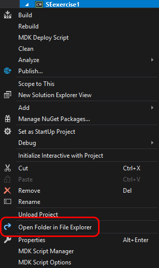

It was brought to our attention that none of the buildings on our new base had proper life-support system.

Any life support system includes several important sub-systems.
Most critical life-support sub-system is ventilation.
Ventilation is responsible for pressurizing the room by providing enough oxygen.

> Hint: make sure to check tips below

However, pressurization is impossible if the room is not airtight.

The room on our new base does have all components to make it airtight, but as soon as the `Main Door` is opened, all the oxygen escapes the room.

A few things have been done in order to implement that vital system on the new base:
- a vent was installed and connected to the O2/H2 generator inside the room
- a two-phase `Airtight Door` was installed that consists of `Airtight Door Internal` and `Airtight Door External`
- the Main Door was disabled to prevent oxygen from escaping by accident

The two-phase `Airtight Door` works by having only one of the two doors open at any given time.

It is possible to enter and leave the room without letting oxygen out by using the two-phase `Airtight Door`, but there a few problems when operating that door:
- it is easy to make a mistake and let oxygen out as the result of both doors (`Internal` and `External`) being open at the same time
- it is not optimal when operating the door manually as you may end up wasting time (it's a fraction, but still)
- it is tiresome to operate it again and again, which increases the chances to make a mistake

Thankfully, we can automate that process using the installed `PB for Airtight Door` (Programmable Block).

Here is a rough algorithm to implement:
1. When either the `Airtight Door Internal` or `Airtight Door External` is opened:
  - set a flag (e.g. a `bool` class variable named `sequenceStarted`) indicating that sequence has started
  - remember which door was opened (e.g. another class variable)
  - start `timer1` (like the `counter` that was used in `Exercise 1`) to let the person enter the door
2. When `timer1` elapses:
  - close the opened door
  - start a `timer2` to wait until the door is closed
3. When `timer2` elapses:
  - open the other door
  - start `timer3` to the the person through the other door
4. When `timer3` elapses, close the other door

You would still see some air escaping through `Airtight Door External` when it is opened, but amount of wasted oxygen is negligibly small.

# Tips

## 

To make a copy of a `Visual Studio` project, you need to:
1. create a new project (for this exercise name it `SEexample1`)
2. find new project's folder (see below)
3. find old project's folder (see below)
4. select necessary `.cs` files in the old project's folder and copy them to the new project's folder
5. add new files to the new project

### Find project's folder

To find a project's folder, open the project in `Visual Studio`, right-click on the project in the right panel and select `Open Folder in File Explorer`.

{: .center-image }

Same applies to both projects - new and old.

### Select and copy necessary files

You will usually need to select all files with `.cs` extension in the old project (which you want to make copy of). Here is an example for project `SEtut9`.

{: .center-image }

Copy selected files to the new project's folder.

### Add new files to new project

Last thing to do is to add new files to the new project.
This is necessary because `Visual Studio` does not add new files to project automatically.

In order to add those new files to the project, right-click on the project in the right panel, select `Add > Existing Item`, select the files you copied over to the new project and click the `Add` button.

{: .center-image }

Everything should be good now.  
If something went wrong, repeat the steps, but make sure to follow instructions carefully.

## Diagrams

It may be helpful to create a flowchart diagram of the algorithm to look at it graphically.
You have the tool for that - `draw.io`.
Just type `draw.io` in the Windows menu, like you would to start `Notepad`.

Flowchart symbols will be in the left panel, in `Flowchart` section.

> Caution! Don't open two `draw.io` windows. If you do, settings will reset and you will get the default `White` theme. To get `Dark` theme back, select `Extras > Theme > Dark` and restart `draw.io`
{: .caution }
